# Continuous Deployment of Database Backed Microservices Using Developer Cloud, Application Container Cloud and Database Cloud

[Abishek Gupta](https://community.oracle.com/people/Abhishek%20Gupta-Oracle?customTheme=otn) wrote a nice article on [Integrating Oracle Application Container & Database Cloud using 'Service Bindings'](https://community.oracle.com/community/cloud_computing/oracle-cloud-developer-solutions/blog/2016/11/10/leveraging-service-bindings-in-oracle-application-container-cloud). Here I'm going to show how the delivery of that application can be automated using the [Developer Cloud Service](https://cloud.oracle.com/developer_service).

## Pre-requisites
- Oracle [Application Container Cloud](https://cloud.oracle.com/en_US/application-container-cloud) Service
- Oracle [Database Cloud](https://cloud.oracle.com/database) Service
- A [GitHub](https://github.com/) account.
- You have [Git](https://git-scm.com/) installed.

## Setup

### Get the Source
- Fork the https://github.com/wbleonard/accs-dbcs-devcs to your GitHub account.
- Clone the https://github.com/{your-github-id}/accs-dbcs-devcs to your local workstation:

### Configure the Oracle Maven Repository
As a departure from Abishek's article, we will fetch the Oracle JDBC driver from the [Oracle Maven Repository](http://www.oracle.com/webfolder/application/maven/index.html).

#### Configure the Maven settings.xml
 Access to the Oracle Maven Repository requires your Oracle Account credentials, so your Maven settings.xml file needs to be configured to provide this information.  Add the following `<server>` element to the `<servers>` section of the settings.xml, replacing the Oracle Account username and password with your credentials:

	
   	<servers>
        <server>
            <id>maven.oracle.com</id>
            <username>{Oracle Account username}</username>
            <password>{Oracle Account password}</password>
            <configuration>
                <basicAuthScope>
                    <host>ANY</host>
                    <port>ANY</port>
                    <realm>OAM 11g</realm>
                </basicAuthScope>
                <httpConfiguration>
                    <all>
                        <params>
                            <property>
                                <name>http.protocol.allow-circular-redirects</name>
                                <value>%b,true</value>
                            </property>
                        </params>
                    </all>
                </httpConfiguration>
            </configuration>
        </server>
    </servers>
	

For additional details, see [Configuring the HTTP Wagon](http://docs.oracle.com/middleware/1213/core/MAVEN/config_maven_repo.htm#A1121152). 

#### Configure the Project POM
The Oracle Maven repository definition needs to be added to your project POM. For local builds, you can add this definition to your settings.xml, but for Developer Cloud builds, the repository must be specified in your project POM. There are a couple of reasons for this:
1. The order in which repositories are specified in the POM dictates the search order, and therefore where the artifact is fetched from. This is best left to user to control.
2. When we get into more complex inherited POM files, the Developer Cloud Service cannot tell without building an effective pom if the maven id is already used or if it will be overridden.

You will find the following in the projects [pom.xml](https://github.com/wbleonard/accs-dbcs-devcs/blob/master/pom.xml):


    <repositories>
        <repository>
            <id>maven.oracle.com</id>
            <releases>
                <enabled>true</enabled>
            </releases>
            <snapshots>
                <enabled>false</enabled>
            </snapshots>
            <url>https://maven.oracle.com</url>
            <layout>default</layout>
        </repository>
    </repositories>
 
### Test a Local Build
Let's ensure our Maven configuration properly pulls the Oracle ODBJ jar from the Oracle Maven repository:

	{ accs-dbcs-devcs } master » mvn clean package
	[INFO] Scanning for projects...
	[INFO]
	[INFO] ------------------------------------------------------------------------
	[INFO] Building accs-dbcs-service-binding-sample 1.0
	[INFO] ------------------------------------------------------------------------
	Downloading: https://maven.oracle.com/com/oracle/jdbc/ojdbc7/12.1.0.2/ojdbc7-12.1.0.2.pom
	Downloaded: https://maven.oracle.com/com/oracle/jdbc/ojdbc7/12.1.0.2/ojdbc7-12.1.0.2.pom (6 KB at 0.7 KB/sec)
	...
	[INFO] Building zip: C:\ProjectsGit\Database\accs-dbcs-devcs\target\accs-dbcs-service-binding-sample-1.0-ACCS.zip
	[INFO] ------------------------------------------------------------------------
	[INFO] BUILD SUCCESS
	[INFO] ------------------------------------------------------------------------
	[INFO] Total time: 47.503 s
	[INFO] Finished at: 2017-04-19T15:42:48-04:00
	[INFO] Final Memory: 36M/433M
	[INFO] ------------------------------------------------------------------------
	
You will also notice that the package command builds the zip artifact that required by ACCS for deployment (accs-dbcs-service-binding-sample-1.0-ACCS.zip). This was achieved by the addition of the [Maven Assembly Plugin](http://maven.apache.org/plugins/maven-assembly-plugin/) to the POM.

	        <plugin>
	            <artifactId>maven-assembly-plugin</artifactId>
	            <version>2.6</version>
	            <configuration>
	                <descriptor>src/assembly/accs.xml</descriptor>
	            </configuration>
	            <executions>
	                <execution>
	                    <phase>package</phase>
	                    <goals>
	                        <goal>single</goal>
	                    </goals>
	                </execution>
	            </executions>                
	        </plugin>            


### Set up Continuous Integration

- In either a new or existing Developer Cloud Service project, select Administration > Repositories

- Create a New External Repository and set the URL to https://github.com/{your-github-id}/accs-dbcs-devcs.git. Optionally set the Description to something like **A repository to demonstrate continuous integration and deployment of a Java microservice that includes a database tier.**

	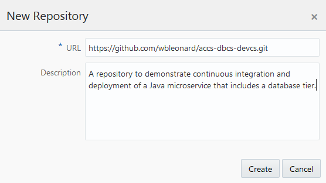

- Create a New free-style Build Job named **Database DevOps**

 	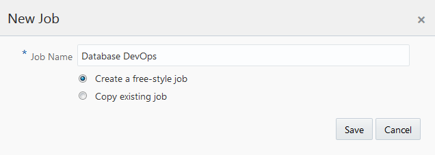

	- Under **Main**, set the JDK to **JDK 8**:
		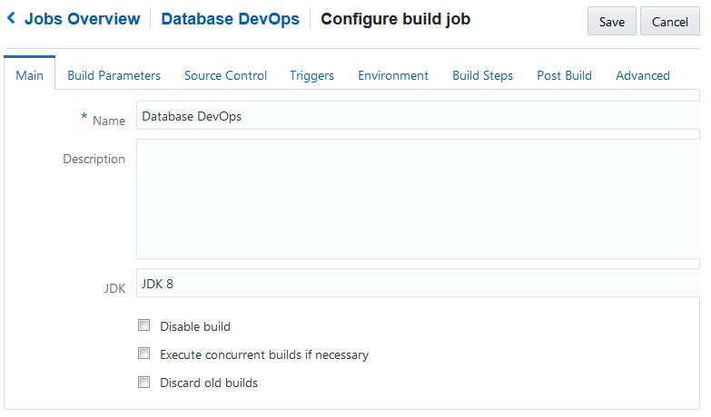

	- Under **Source Control**, select the accs-dbcs-devcs.git repository:
 		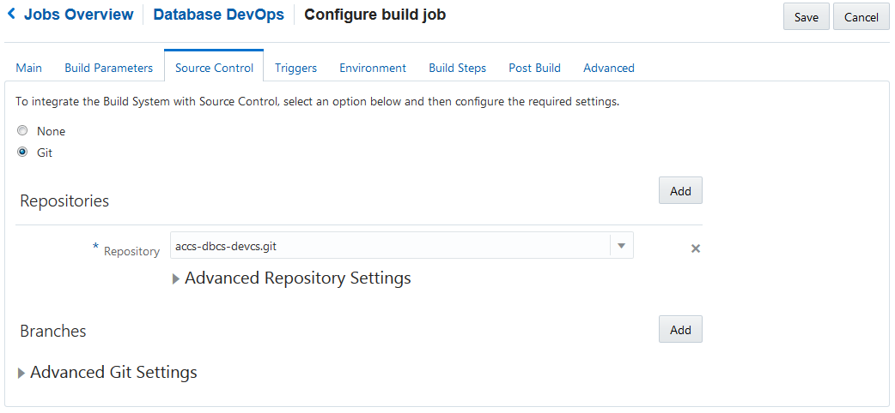

	- Under **Triggers** select Based on SCM polling schedule and set the Schedule to `*****`:
	 
		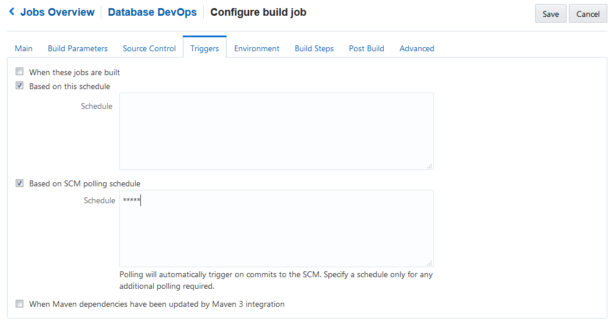

	- Under **Environment** select Connect Oracle Maven Repository and enter your OTN credentials:
	 
		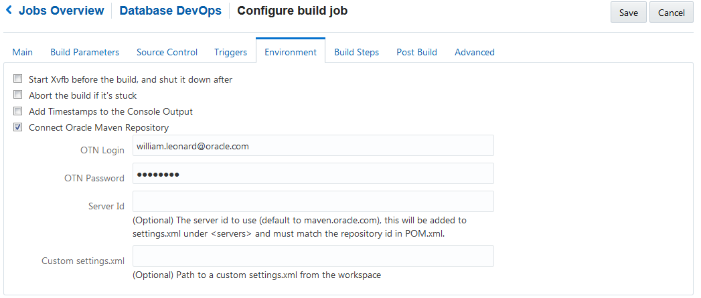

	- Under **Build Steps** add an Invoke Maven 3 Build Step:
	 
		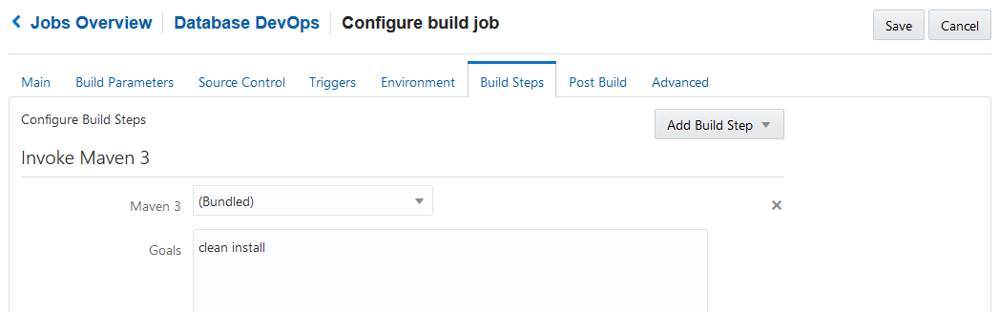	

	- Under **Post Build**, select Archive the Artifacts and set the Files to Archive to `**/target/*.zip`:
 
		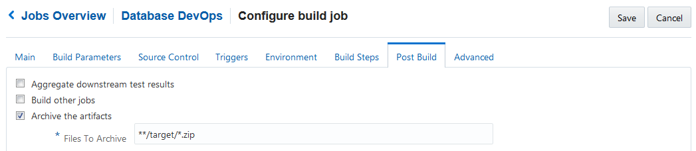	

	- **Save** and click **Build Now** to validate the build configuration:

### Set up Continuous Deployment

- Create a new Deployment Configuration named **Database DevOps**
	- Create a new Deployment Target to the Application Container Cloud:
 	
	- Set the ACCS Runtime property to **Java ** and Subscription property to **Hourly**
	- Select **Automatic** and **Deploy stable builds only**.
	- Select Job **Database DevOps** and Artifact **target/accs-dbcs-service-binding-sample-1.0-ACCS.zip**:
		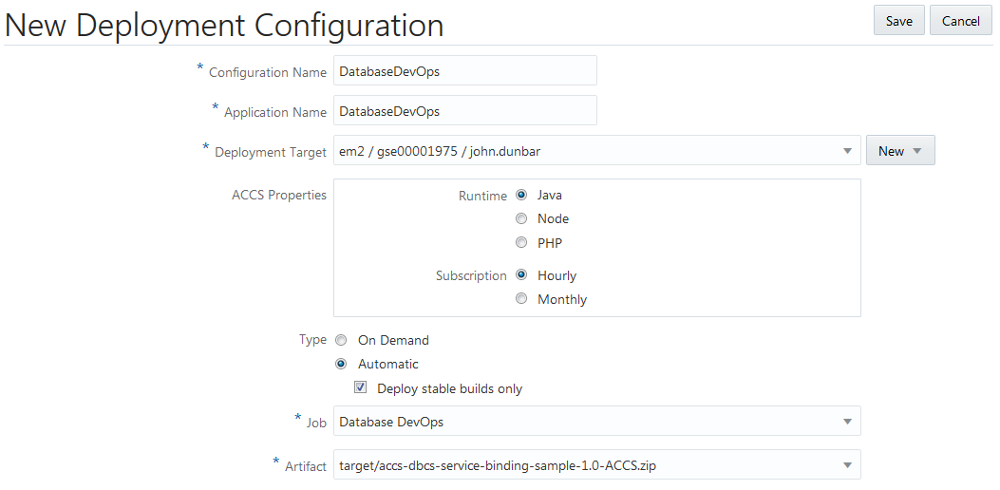
- Save and Start the Database DevOps Deployment Configuration

### Set up the Database

In either a new or existing Database Cloud Service instance, let's create a new schema for this exercise:

	```
	SQL> CREATE USER DEVOPS IDENTIFIED BY DEVOPS;
	
	User created.
	
	SQL> GRANT CONNECT, RESOURCE, UNLIMITED TABLESPACE TO DEVOPS;
	
	Grant succeeded.
	```

### Configure the Application Container Cloud Service Bindings

Now we need to bind the DatabaseDevOps Application Container Cloud instance to our Oracle Database Cloud instance. 

 - Navigate to the DatabaseDevOps Application Container Cloud instance and select the Deployments tab. Then Add a Service Binding to the Database Cloud Service, selecting the name of the Service in which you created the DEVOPS user:
	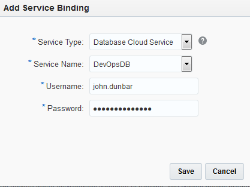

- We also need to add a couple of Environment Variables to store the Oracle database username and password:
	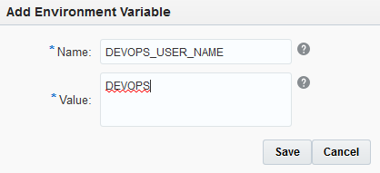
	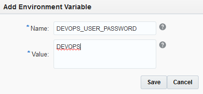

- Click **Apply Edits** which will apply the changes and restart the microservice:
	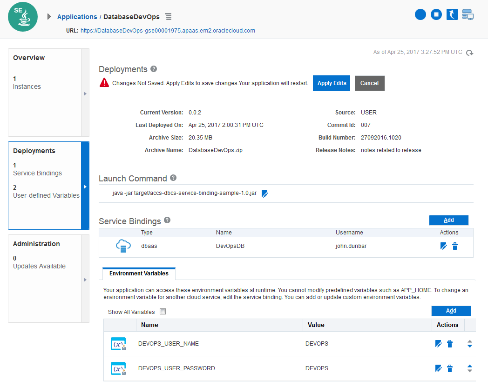

### Test the Microservice

Append **/appdev/products** to the end of the Application Container Cloud URL. For example:

https://databasedevops-gse00001975.apaas.em2.oraclecloud.com/appdev/products

	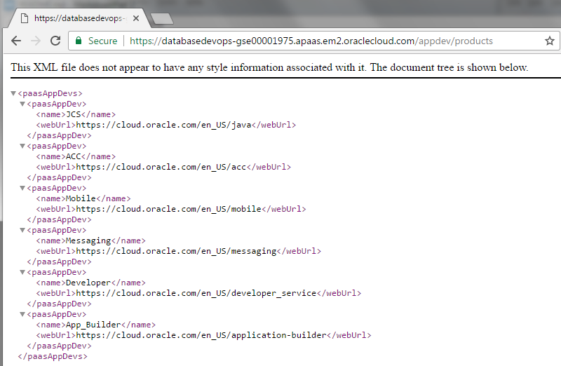


	


 
